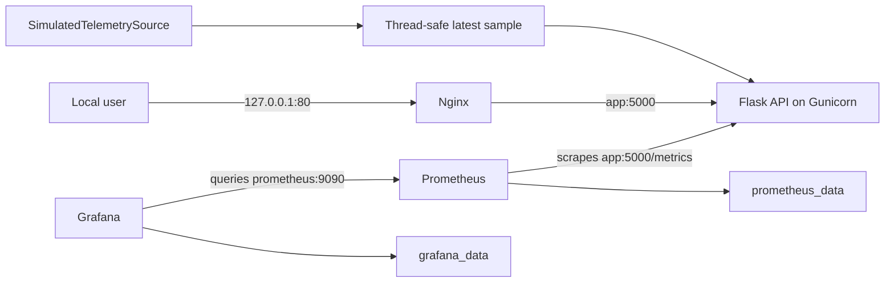
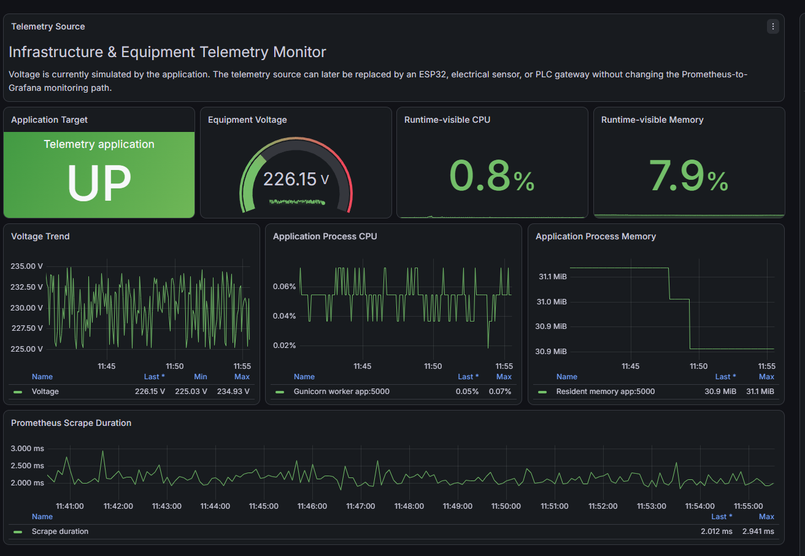

# Infrastructure & Equipment Telemetry Monitor

A small, containerized monitoring project that demonstrates service
troubleshooting, Docker networking, health checks, Prometheus metrics, and
automatic Grafana provisioning. The equipment voltage is **simulated**; no
physical sensor, ESP32, PLC, MQTT, or Modbus integration is implemented.

## What is implemented

- Flask API served by Gunicorn as a non-root container user
- `/healthz`, `/readyz`, and Prometheus `/metrics` endpoints
- Background sampling with a replaceable `TelemetrySource` abstraction
- Nginx reverse proxy on `127.0.0.1:80`
- Prometheus scraping `app:5000` over the internal Docker network
- Automatically provisioned Grafana datasource and dashboard
- Persistent Prometheus and Grafana named volumes
- Docker healthchecks and health-based startup ordering
- Pytest coverage for API and telemetry behavior
- GitHub Actions tests, Terraform validation, and GHCR image publishing
- An AWS EC2 Terraform **scaffold**, not an application deployment
- Kubernetes application manifests, separate from the Compose monitoring stack

## Architecture



The simulator produces equipment voltage between 225 and 235 volts. CPU and
RAM gauges describe host/container-visible values reported by `psutil`. The
Python Prometheus client also exposes standard `process_*` metrics.

The acquisition interface is intentionally small so a real sensor or gateway
could replace the simulator later without changing Prometheus or Grafana. Such
an adapter is not included in this repository.

## Prerequisites

- Git
- Docker Desktop or Docker Engine with Docker Compose v2

Python and Terraform are needed only for running those tools directly on the
host. The main monitoring stack runs through Docker Compose.

## Quick start

```bash
git clone https://github.com/M-Lukovic/cloud-telemetry-pipeline.git
cd cloud-telemetry-pipeline
docker compose config
docker compose up -d --build
docker compose ps
```

| Component | URL |
| --- | --- |
| Application through Nginx | http://127.0.0.1/ |
| Liveness | http://127.0.0.1/healthz |
| Readiness | http://127.0.0.1/readyz |
| Metrics | http://127.0.0.1/metrics |
| Prometheus | http://127.0.0.1:9090 |
| Grafana | http://127.0.0.1:3000 |

Grafana provisions the `Prometheus` datasource and the **Infrastructure &
Equipment Telemetry Monitor** dashboard automatically. Grafana may request the
default local administrator credentials on a fresh volume; change them if the
stack is used beyond an isolated local demonstration.

## Configuration

Optional variables and safe defaults are documented in [`.env.example`](.env.example):

- `SERVICE_NAME`
- `SERVICE_VERSION`
- `LOG_LEVEL`
- `TELEMETRY_MODE` — only `simulated` is supported
- `TELEMETRY_SAMPLE_INTERVAL_SECONDS` — defaults to `5`

Compose injects these values with the documented defaults. Copy `.env.example`
to `.env` to override them locally; `.env` is ignored by Git.

## Tests and verification

The production image intentionally excludes test dependencies. Run tests with:

```bash
docker build --target test -t telemetry-app:test ./app
docker run --rm telemetry-app:test
```

Verify the complete stack:

```bash
docker compose up -d --build
docker compose ps
docker compose logs --no-color app nginx prometheus grafana
curl -f http://127.0.0.1/healthz
curl -f http://127.0.0.1/readyz
curl -f http://127.0.0.1/metrics
curl -f http://127.0.0.1:9090/-/healthy
curl -f http://127.0.0.1:3000/api/health
```

Prometheus target query:

```text
http://127.0.0.1:9090/api/v1/query?query=up%7Bjob%3D%22telemetry_app%22%7D
```

Stop containers without deleting monitoring data:

```bash
docker compose down
```

`docker compose down -v` permanently removes the locally collected Prometheus
and Grafana data.

## Troubleshooting workflow

1. Run `docker compose ps` and identify unhealthy or stopped services.
2. Inspect one service with `docker compose logs SERVICE`.
3. Test `/healthz` and `/readyz` through Nginx.
4. Open Prometheus `/targets` and confirm `telemetry_app` is `UP`.
5. Query `up{job="telemetry_app"}` in Prometheus.
6. Confirm Grafana has the provisioned datasource and `Telemetry` folder.
7. Run `docker compose config` to catch syntax or interpolation errors.

## Screenshot



## Infrastructure scope and limitations

### Docker Compose

Compose is the only complete local deployment path in this repository. The
application stays internal; Nginx, Prometheus, and Grafana bind only to the
local loopback interface.

### Terraform

The Terraform directory is an educational AWS EC2 scaffold. It defines an EC2
instance and an HTTP-only security group, but it does **not** install Docker,
deploy this repository, configure TLS/DNS, or connect GitHub Actions to AWS.
Do not run `terraform apply` without reviewing the cost and account impact.

### Kubernetes

The Kubernetes directory deploys only the application and a ClusterIP Service.
It does not deploy Nginx, Prometheus, Grafana, persistent monitoring storage, or
an ingress controller. It is not the deployment path used by Docker Compose.

### Gunicorn sampling

The container uses one Gunicorn worker because telemetry state is in memory.
Multiple workers would each own an independent simulator and metric registry. A
production multi-worker design would need a dedicated acquisition process or
external shared source.

## Security notes

- The application container runs as a non-root user.
- Application port 5000 is not published to the host.
- Published Compose ports bind to `127.0.0.1` for local use.
- No secrets belong in this repository; `.env` files are ignored.
- Prometheus and Grafana are not configured for public Internet exposure.

## License

MIT — see [`LICENSE`](LICENSE).
